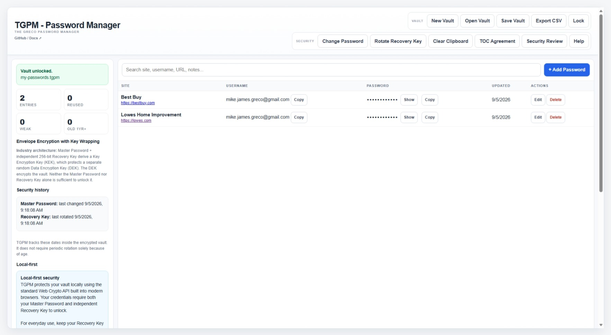

# TGPM - Password Manager

**The Greco Password Manager**

A dependency-free, local-first password manager built around a portable encrypted vault, an independent Recovery Key, and no account or application server.

TGPM is built as a **Single-File Local Application (SFLA)**. The complete application runs from a single HTML file with no framework, package manager, installation process, application backend, or third-party runtime dependencies.

Create an encrypted vault, keep the vault file wherever you choose, and keep the independently generated Recovery Key separately.

> **Your passwords. One encrypted file. No account. No server.**



## Run TGPM

**[▶ Run TGPM in your browser](https://mikejamesgreco.github.io/tgpm-password-manager/)**

No installation is required. The GitHub Pages version runs TGPM directly in your browser, or you can download and open `tgpm-password-manager.html` locally in a modern browser.

TGPM is local-first. Vault creation, encryption, decryption, credential editing, password generation, security review, and normal file operations occur in the browser.

---

## Why TGPM?

Many password managers depend on an account, hosted service, synchronization backend, browser extension, subscription, or proprietary cloud vault.

TGPM takes a different approach.

```text
                         Master Password
                               │
                               ▼
Encrypted .tgpm Vault ──►    TGPM    ◄── .tgpmkey Recovery Key
                               │
                               ▼
                     Unlocked Local Vault
                               │
                    ┌──────────┴──────────┐
                    ▼                     ▼
              Updated Vault        Plaintext CSV
                                    (optional)
```

The encrypted vault is a file you control.

TGPM does not provide an account, cloud vault, password-reset service, or server-side recovery mechanism.

---

## Core Principles

TGPM is designed around a few simple principles:

- **Local-first** — credential data is processed in the browser.
- **Single-file application** — the application is distributed as one HTML file.
- **Zero third-party runtime dependencies** — no frameworks, CDNs, or runtime packages are required.
- **User-owned vault** — the encrypted `.tgpm` file belongs to the user and can be stored wherever the user chooses.
- **Independent Recovery Key** — unlocking requires both the Master Password and a separately stored `.tgpmkey` Recovery Key.
- **No account or application server** — TGPM does not require registration or a hosted TGPM backend.
- **Portable by design** — the vault is an ordinary encrypted file rather than an account-bound cloud object.
- **Exit is possible** — an unlocked vault can be exported to plaintext CSV for migration, printing, or archival.
- **Browser-native APIs first** — native browser cryptography and file capabilities are preferred wherever practical.

---

## Getting Started

1. Open the **[hosted TGPM Password Manager](https://mikejamesgreco.github.io/tgpm-password-manager/)** or open `tgpm-password-manager.html` locally.
2. Choose **New Vault**.
3. Create a Master Password.
4. Generate and save the TGPM Recovery Key.
5. Verify the saved Recovery Key when TGPM asks you to select it again.
6. Create the encrypted vault.
7. Add password entries and save the vault.

Every future unlock requires:

```text
Master Password
      +
TGPM Recovery Key
      +
Encrypted TGPM Vault
```

Keep multiple Recovery Key backups and preferably keep them separate from the encrypted vault.

---

## Vault Files

TGPM intentionally separates the encrypted vault from its Recovery Key.

### Encrypted Vault

```text
my-passwords.tgpm
```

The `.tgpm` file contains the encrypted credential payload and the cryptographic metadata required to unlock it.

### Recovery Key

```text
tgpm-recovery-key.tgpmkey
```

The `.tgpmkey` file contains an independently generated 256-bit Recovery Key.

The Recovery Key should not be treated as a password hint or a replacement for the Master Password. Both secrets are required.

---

## Encryption Architecture

TGPM uses an architecture commonly described as **Envelope Encryption with Key Wrapping**.

```text
Master Password
      │
      ▼
PBKDF2-HMAC-SHA-256
      │
      ├─────────────── Recovery Key
      │                     │
      └──────────┬──────────┘
                 ▼
          HKDF-SHA-256
                 │
                 ▼
       Key Encryption Key
              (KEK)
                 │
                 ▼
        AES-256-GCM wraps
                 │
                 ▼
       Data Encryption Key
              (DEK)
                 │
                 ▼
        AES-256-GCM encrypts
                 │
                 ▼
          Vault Payload
```

The credential payload is encrypted with a separate random 256-bit **Data Encryption Key (DEK)**.

The Master Password is processed with **PBKDF2-HMAC-SHA-256** using 600,000 iterations. Password-derived material and the independent 256-bit Recovery Key are combined through **HKDF-SHA-256** to derive a **Key Encryption Key (KEK)**.

The KEK protects, or wraps, the DEK using **AES-256-GCM**. The DEK encrypts the vault payload using **AES-256-GCM**.

This design allows TGPM to change a Master Password or rotate a Recovery Key by re-wrapping the DEK rather than replacing the credential-encryption key for every stored record.

The terms KEK, DEK, envelope encryption, and key wrapping are established cryptographic/key-management terminology. Their use here does **not** mean TGPM is certified, approved, or independently audited by OWASP or NIST.

Useful references:

- [OWASP Key Management Cheat Sheet](https://cheatsheetseries.owasp.org/cheatsheets/Key_Management_Cheat_Sheet.html)
- [OWASP Secrets Management Cheat Sheet](https://cheatsheetseries.owasp.org/cheatsheets/Secrets_Management_Cheat_Sheet.html)
- [OWASP Password Storage Cheat Sheet](https://cheatsheetseries.owasp.org/cheatsheets/Password_Storage_Cheat_Sheet.html)
- [NIST — Key Encryption Key](https://csrc.nist.gov/glossary/term/key_encryption_key)
- [NIST — Key Wrapping](https://csrc.nist.gov/glossary/term/key_wrapping)

---

## Master Password

TGPM requires a Master Password of at least 15 characters and locally rejects common or obviously predictable choices.

The Master Password is not stored as plaintext in the vault.

TGPM does not force periodic Master Password changes solely because of age. A Master Password should be changed when compromise is known or suspected or when the user otherwise decides it should be replaced.

Changing the Master Password keeps the Recovery Key and existing DEK and re-wraps the DEK using newly derived key material.

---

## Recovery Key

The Recovery Key is generated locally using the browser's cryptographically secure random-number generator.

TGPM requires the newly generated key file to be selected again and verified before a new vault can be created.

Recovery Keys can also be rotated.

During rotation TGPM:

1. Authenticates the current Master Password and Recovery Key.
2. Generates a new independent 256-bit Recovery Key.
3. Requires the newly saved `.tgpmkey` file to be verified.
4. Derives a new KEK.
5. Re-wraps the existing DEK.
6. Saves the updated encrypted vault.

The old Recovery Key no longer unlocks the newly saved vault after a completed rotation.

---

## Password Entries

TGPM stores credential records inside the encrypted vault.

Current entry information includes:

- Site / title
- Username
- Password
- URL
- Notes
- Created date
- Updated date
- Entry ID

The workspace provides local search, password generation, password visibility controls, copy actions, editing, and deletion.

TGPM also surfaces informational counts for reused, weak, and older passwords.

---

## Password Generator

TGPM includes a local password generator.

Generated passwords are created in the browser and are not sent to a TGPM service.

---

## Auto-Lock and Clipboard Controls

TGPM automatically locks an unlocked vault after five minutes of inactivity.

Locking clears the active vault state and sensitive form fields from the application UI.

TGPM provides explicit password copy actions and an explicit **Clear Clipboard** control. Clipboard behavior remains subject to the capabilities and policies of the browser and operating system.

---

## Plaintext CSV Export

An unlocked vault can be exported as UTF-8 CSV.

The export includes:

- Site / Title
- Username
- Password
- URL
- Notes
- Created
- Updated
- Entry ID

This feature is intentionally an **unencrypted escape hatch** for migration, printing, physical archival, or moving credentials to another tool.

> **A plaintext CSV export is no longer protected by TGPM encryption.**

Treat exported CSV files like a printed password list. Secure them appropriately and delete or destroy copies when they are no longer required.

TGPM enables **Spreadsheet-safe mode** by default to reduce CSV/formula-injection risk when an export is opened in spreadsheet software. The option can be disabled when exact raw field values are required for migration.

---

## Security History

TGPM stores security-history metadata inside the encrypted vault, including Master Password changes and Recovery Key rotations.

The application can provide informational age/review guidance without forcing arbitrary periodic credential rotation.

---

## Terms, Security Responsibilities, and Acceptance

TGPM includes an in-vault user acceptance record.

Acceptance is requested when:

- A new vault is created.
- An existing vault has no acceptance record.
- The running TGPM application version has not yet been accepted for that vault.

Each acceptance record includes the complete agreement text, SHA-256 agreement digest, typed signature/name, TGPM application version, and local acceptance timestamp.

Prior records are retained without an edit/delete control in the TGPM UI.

The accepted agreement can also be exported locally as a printable PNG.

These records are **not** an external notarization, trusted timestamp service, or cryptographically immutable record. A user who controls a local file ultimately controls that file.

---

## Security Review

TGPM includes a built-in **Security Review** intended to catch security drift between versions.

The review checks live runtime assumptions and monitored source-code patterns, including areas such as:

- Cryptographic configuration
- External-resource expectations
- DOM-writing patterns
- Clipboard behavior
- Auto-lock expectations
- Credential DOM handling
- Local agreement export
- Plaintext CSV export
- Browser-environment documentation
- Encryption-architecture documentation

TGPM also contains a deterministic synthetic cryptographic self-test so important cryptographic operations can be regression-tested without using real credentials.

The Security Review is a development and runtime regression aid.

> **It is not an independent third-party security audit.**

---

## Malformed File Handling

TGPM validates the structure of `.tgpm` vaults and `.tgpmkey` Recovery Key files before normal unlock processing.

Malformed or unsupported structures fail closed rather than being treated as valid vault material.

Authentication/decryption failure is kept distinct from malformed-file validation where practical.

---

## Browser Environment and Extensions

TGPM runs inside the browser, so the browser environment is part of the security boundary.

A browser extension with permission to read or modify the TGPM page may be able to observe sensitive information after a vault is unlocked.

TGPM cannot reliably enumerate, verify, or temporarily disable all browser extensions.

For higher-security use, consider using a fresh **InPrivate/Incognito** window with unneeded extensions not permitted to run there. If TGPM is opened as a local HTML file, browser settings controlling extension access to `file:` URLs are also relevant.

Proceed only when you trust the browser, device, and extensions that can access the TGPM page.

Private browsing does not protect against a compromised browser, operating-system malware, keylogging, screen capture, or extensions explicitly permitted to run in that private session.

---

## Local-First Architecture

TGPM does not require a TGPM backend server.

```text
┌──────────────────────── Browser ────────────────────────┐
│                                                        │
│  .tgpm ──┐                                             │
│           ├──► TGPM ──► Unlock / Edit / Generate       │
│ .tgpmkey ─┘        │                                    │
│                    ├──► encrypted .tgpm                 │
│                    └──► optional plaintext CSV          │
│                                                        │
└────────────────────────────────────────────────────────┘
```

Normal vault processing occurs locally in the browser.

TGPM does not need to upload the user's credential vault to a TGPM application service in order to operate.

---

## Browser Support

TGPM is designed for modern desktop browsers with the Web Crypto API.

Chromium-based browsers such as Microsoft Edge and Google Chrome currently provide the broadest support for the browser-native file capabilities used by TGPM.

Where the File System Access API is available, TGPM can work more directly with a selected vault file. Fallback browser download/file-selection behavior is used where appropriate.

---

## Single-File Local Application (SFLA)

TGPM follows an architecture we refer to as a **Single-File Local Application**, or **SFLA**.

For TGPM this means:

```text
tgpm-password-manager.html
```

contains the complete application.

No framework, package installation, build environment, or application server is required to run it.

The surrounding repository can contain documentation, screenshots, tests, and other development resources, but they are not required by the application at runtime.

---

## Repository Structure

The repository is intentionally simple.

```text
tgpm-password-manager/
│
├── index.html                    # GitHub Pages launcher
├── tgpm-password-manager.html    # Standalone TGPM application
├── screenshot.jpeg              # README screenshot
├── README.md
├── CHANGELOG.md
└── LICENSE
```

The exact structure may evolve as the project grows.

---

## Security Boundary

TGPM protects the contents of a properly locked encrypted vault, but no browser application can eliminate every security risk around an unlocked vault.

Important responsibilities remain outside TGPM, including:

- Protecting the Master Password.
- Protecting and backing up the Recovery Key.
- Keeping the Recovery Key appropriately separate from the vault.
- Protecting plaintext CSV exports and printed password lists.
- Securing the computer and operating system.
- Using a trustworthy browser environment.
- Reviewing browser extensions and their permissions.
- Protecting backups and historical copies.
- Locking TGPM when finished.

If both required unlock factors cannot be supplied, TGPM has no password-reset service or backdoor that can recover the vault.

---

## Security Status

TGPM has been designed with explicit security controls, local regression checks, deterministic cryptographic testing, malformed-file validation, and documented security boundaries.

However:

> **TGPM has not yet undergone an independent third-party security audit.**

Do not interpret the use of standard browser cryptographic primitives or references to OWASP/NIST terminology as certification or independent validation of the complete TGPM implementation.

Users should evaluate TGPM and its source code according to their own security requirements before entrusting it with important credentials.

---

## Privacy

TGPM is local-first.

TGPM does not require an account or TGPM-hosted credential service to operate.

Users should still consider the behavior and security of:

- Their browser
- Browser extensions
- Their operating system
- File-sync software used to store a vault
- Backup systems
- Antivirus/security software
- Plaintext exports
- Any other software capable of observing the unlocked browser session or local files

---

## Portability and Backups

Because the vault is an encrypted file, it can be stored using ordinary user-controlled storage.

Examples include:

- Local disk
- USB storage
- OneDrive
- Dropbox
- Google Drive
- NAS storage
- Other filesystem-based backup/synchronization tools

TGPM itself does not synchronize passwords. If the vault is stored in a synchronized folder, the filesystem/synchronization provider synchronizes the encrypted vault file.

> **TGPM doesn't sync your passwords. Your filesystem syncs your encrypted vault.**

Maintain independent backups appropriate to the importance of the credentials being stored.

---

## Project Status

TGPM is under active development.

The current application is designed for everyday password storage and includes the core vault lifecycle, Recovery Key management, password management, portability/export, security documentation, and built-in regression review.

Future features may expand backup and recovery options while preserving the local-first architecture.

---

## Philosophy

TGPM is intentionally built differently from many hosted password managers.

```text
No account.
No application server.
No framework.
No package manager.
No third-party runtime dependencies.

One browser.
One encrypted vault.
One separately stored Recovery Key.
Your passwords under your control.
```

---

## License

License information will be added to the repository's `LICENSE` file.

---

## Author

**Michael J. Greco**

TGPM - Password Manager — **The Greco Password Manager**

© mikejamesgreco.me LLC. All rights reserved.
